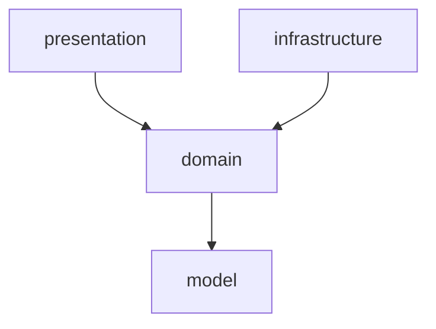

# CLAUDE.md

This file provides guidance to Claude Code (claude.ai/code) when working with code in this repository.

## ⚠️ Instructions for Claude Code

- **이 파일(CLAUDE.md)을 임의로 수정하거나 내용을 삭제하지 말 것.**
- 작업 지시에 명시된 파일만 생성/수정할 것. 범위 외 파일은 건드리지 말 것.
- 기존 소스 파일을 "불필요하다"고 판단해 삭제하지 말 것. 삭제는 명시적으로 요청받은 경우에만 수행할 것.

## Project Overview

**readum** — a Spring Boot 4.0.5 web application using Java 25, Gradle 9.4.1, and Lombok.

## Build & Run Commands

```bash
# Build
./gradlew build

# Run the application
./gradlew bootRun

# Run all tests
./gradlew test

# Run a single test class
./gradlew test --tests "com.readum.SomeTest"

# Run a single test method
./gradlew test --tests "com.readum.SomeTest.methodName"

# Clean build
./gradlew clean build
```

## Architecture

- **Base package**: `com.readum` — Spring Boot auto-scans from here
- **Framework**: Spring Boot 4.0.5 with `spring-boot-starter-webmvc` (servlet-based web)
- **Build**: Gradle with `io.spring.dependency-management` plugin for BOM-managed dependencies
- **Java version**: 25
- **Lombok**: Available in both main and test source sets (compileOnly + annotationProcessor)
- **Testing**: JUnit 5 via `junit-platform-launcher`; Spring test support via `spring-boot-starter-webmvc-test`

### Package Structure (4-Layer)

```
com.readum
├── presentation/                # API 계층
│   └── controller/{feature}/
│       ├── {Feature}Controller.java
│       └── dto/
│           ├── {Action}Request.java
│           └── {Feature}Response.java
├── domain/                      # 비즈니스 로직
│   └── {feature}/
│       ├── service/
│       │   ├── {Action}Service.java         # Command 서비스
│       │   └── {Feature}SearchService.java  # Query 서비스
│       ├── out/
│       │   └── {Feature}{Action}Client.java # Port 인터페이스
│       └── dto/
│           ├── {Action}Command.java
│           ├── {Action}Result.java
│           └── {Feature}Result.java
├── infrastructure/              # 외부 의존 구현 (Adapter)
│   └── {feature}/{provider}/
│       └── {Port}Impl.java
└── model/                       # 엔티티, 리포지토리
    └── {feature}/
        ├── entity/
        │   └── {Entity}.java
        └── repository/
            └── {Entity}Repository.java
```

> Example 참조 구현체: 각 패키지의 `example/` 하위에 위치. 새 기능 생성 시 이 파일들을 참조할 것.

### Dependency Rules



| From | To | Allowed | Notes |
|------|----|:-------:|-------|
| presentation | domain | O | Controller -> Service |
| infrastructure | domain | O | Port(out) 구현 |
| domain | model | O | Service -> Repository |
| presentation | model | **X** | Entity 직접 참조 금지, domain 경유 필수 |
| presentation | infrastructure | **X** | |
| domain | presentation | **X** | 역방향 금지 |
| domain | infrastructure | **X** | Port 인터페이스만 알고 있음 |

## Service Pattern

- 인터페이스 없이 구체 클래스 사용 (`@Service`, `@RequiredArgsConstructor`)
- `Impl` 접미사 사용 금지 (Service에 한함)
- **Command 서비스** (변경 작업): 단일 `execute(Command)` 메서드 -> Result 반환
- **Query 서비스** (조회 작업): 메서드명으로 의도를 드러내며, 여러 메서드 허용
- **도메인 빌딩 블록** (토큰 생성·파싱, 암호화 등): Command/Query 서비스 형태에 맞지 않는 인프라 의존 동작은 `domain/{feature}/out/` 에 Port 인터페이스로 정의하고, 구현체는 `infrastructure/{...}/` 에 Adapter (`{Port}Impl`) 로 둔다. 예: `domain/auth/out/TokenGenerator` ← `infrastructure/security/jwt/JwtTokenGeneratorImpl`

## DTO Convention

- 파라미터 3개 이상이면 DTO(record) 사용
- **presentation DTO**: Request (`toCommand()` 포함), Response (`from(Result)` 포함)
- **domain DTO**: Command, Result
- 계층 간 변환 책임은 presentation DTO가 담당

### Entity → Result DTO 변환 책임

기본 규칙: **Entity → Result DTO 변환은 DTO 의 `from(Entity, ...)` 정적 팩토리로 수행한다.** Service 가 비즈니스 흐름에 집중하도록 변환 잡일을 DTO 로 위임한다.

```java
// ✅ DTO 가 변환 책임 보유
public record UserBookCreateResult(...) {
    public static UserBookCreateResult from(UserBook userBook, Book book) { ... }
}

// service 는 흐름만 표현
return UserBookCreateResult.from(saved, book);
```

```java
// ❌ service 안의 private toResult() 헬퍼 또는 inline new XxxResult(...)
private UserBookCreateResult toResult(UserBook userBook, Book book) { ... }
return new UserBookCreateResult(saved.getId(), saved.getUserId(), ...);
```

- **multi-source 합성도 정적 팩토리에서 처리**: 여러 데이터 출처(여러 entity 또는 entity + 외부 인자) 를 합치는 경우 `from(A, B, ...)` 시그니처로 표현. 두 entity 에 의존하는 게 어색해 보일 수 있지만, service-side 변환 헬퍼와 비교하면 결합 정도는 동일하고 service 가 가벼워진다. 예: `UserBookCreateResult.from(UserBook, Book)`, `UserSessionInfoResult.from(User, boolean hasRegisteredBooks)`.
- **Wrapper DTO (List + 페이지 메타 같은 단순 합성) 는 `from()` 두지 않고 service 에서 직접 생성한다.** 진짜 entity → DTO 변환 책임은 안에 들어가는 element DTO (예: `MessageResult.from(AiChatMessage)`) 가 갖는다. wrapper 의 `from(Slice, ...)` 같은 시그니처는 domain DTO 를 Spring Data 같은 인프라 타입에 결합시키므로 지양한다 — `Slice.hasNext()` unwrap 은 service 가 책임지고, DTO 는 plain types (List, int, boolean) 만 알도록 둔다.

### Service 안에 변환을 두는 예외 케이스

다음 상황에만 service-side 변환(private 메서드 또는 inline 생성)을 허용:

- 변환에 service 의 다른 의존성 호출이 필요할 때 (예: 권한 체크 결과를 합쳐 리턴)
- 변환 결과가 호출자별로 달라질 때 (예: 권한에 따라 일부 필드 마스킹)
- 변환이 service 의 트랜잭션 안에서 LAZY 컬렉션을 만져야 할 때

> 단순히 "외부에서 받은 인자(예: hasRegisteredBooks 같은 boolean) 가 entity 외에 추가로 필요" 한 경우는 예외에 해당하지 않는다 — `from(Entity, extraArg)` 시그니처로 충분히 표현 가능하다.

## Port/Adapter Pattern

- **Port** 인터페이스: `domain/{feature}/out/` 에 위치
- **Adapter** 구현체: `infrastructure/{feature}/{provider}/` 에 위치, `Impl` 접미사 사용
- **적용 기준**: 구현체가 교체될 여지가 있거나 외부 시스템(API, 메시징, 캐시 백엔드 등)을 추상화해야 할 때만 도입한다. 단순 JPA Repository 접근은 `Service → Repository` 직접 호출로 충분하므로 Port 를 두지 않는다.
  - O `TokenBlacklistStore` — 현재 in-memory (Caffeine) 구현이지만 Redis 등으로 교체 여지가 있어 Port 유지
  - X `RefreshTokenStore` — JPA Repository 를 단순 래핑하는 수준이라 Port 없이 Service 가 `RefreshTokenRepository` 를 직접 사용

## Entity Convention

- Lombok: `@Getter`, `@NoArgsConstructor(access = PROTECTED)`, `@AllArgsConstructor(access = PRIVATE)`
- 정적 팩토리 메서드: `create()` (신규 생성), `of()` (모든 필드 지정)
- setter 없이 불변 지향

## JPQL/Query Convention

- **derived query method 우선**: Spring Data JPA 의 메서드 이름 기반 쿼리(`findBy...And...In...OrderBy...`) 로 표현 가능하면 `@Query` 보다 우선 사용한다. JPQL 본문의 enum FQCN/JPQL 문법 노이즈를 피하고 타입 안전성을 얻는다. 조건이 4~5개 이상으로 메서드명이 흉해지면 그때 `@Query` 로 전환.
  ```java
  // ✅ derived (단순 조건)
  List<AiChatMessage> findBySessionIdAndStatusAndRoleInOrderByCreatedAtDescIdDesc(
          Long sessionId, AiChatMessage.Status status, Collection<AiChatMessage.Role> roles, Pageable pageable);

  // ✅ default 메서드로 호출자 시그니처 짧게 유지
  default List<AiChatMessage> findRecentForContextWindow(Long sessionId, Pageable pageable) {
      return findBySessionIdAndStatusAndRoleInOrderByCreatedAtDescIdDesc(
              sessionId, AiChatMessage.Status.COMPLETED,
              List.of(AiChatMessage.Role.USER, AiChatMessage.Role.ASSISTANT), pageable);
  }
  ```
- **엔티티 별칭(alias)**: 단일 문자 약어(`r`, `u`, `t`) 금지. 엔티티 이름을 camelCase 로 풀어 쓴다.
  ```java
  // ❌ update RefreshToken r set r.rotatedAt = :now where r.id = :id
  // ✅ update RefreshToken refreshToken
  //       set refreshToken.rotatedAt = :now
  //     where refreshToken.id = :id
  ```
- **쉼표 위치(leading comma)**: 여러 줄 JPQL 에서 쉼표는 **다음 줄 앞단**에 둔다. 컬럼/필드 정렬이 유지되고 라인 추가 시 diff 가 깨끗함.
  ```java
  // ❌ set refreshToken.a = :x,
  //        refreshToken.b = :y
  // ✅ set refreshToken.a = :x
  //      , refreshToken.b = :y
  ```
- leading comma 규칙은 `@Query` / `@NativeQuery` 텍스트 블럭 내부에 한정한다. Java 메서드 파라미터·인자 리스트·배열 리터럴 등은 기존대로 trailing comma 를 사용.

## Transaction Convention

- **단순 조회 service 에는 `@Transactional(readOnly = true)` 를 붙이지 않는다.** Spring Data JPA 의 `SimpleJpaRepository` 가 클래스 레벨에서 이미 readOnly 트랜잭션을 감싸므로, service 가 단일 Repository 호출만 하면 효과가 중복된다. 다른 Query 서비스 (`UserSearchService`, `AiChatMessageSearchService`, `AiChatHistorySearchService`) 도 이 컨벤션으로 통일.
- 명시적으로 `@Transactional(readOnly = true)` 를 붙이는 예외 케이스 — 효과가 실제로 나타날 때만:
  - 한 service 메서드에서 여러 Repository 호출을 한 트랜잭션으로 묶어 일관된 상태로 읽어야 할 때
  - OSIV 가 꺼진 환경에서 service 의 변환 단계가 LAZY 컬렉션을 접근해야 할 때

## API Convention

- RESTful 원칙 준수
- 경로 패턴: `/api/v1/{resource}`
- `ResponseEntity`로 HTTP 상태 코드 명시

## Swagger Convention

### 컨트롤러 클래스: `@Tag` 필수

Swagger UI 의 그룹명이 클래스명(예: `ai-chat-controller`)으로 표시되지 않도록 모든 컨트롤러에 한국어 라벨을 붙인다.

```java
@Tag(name = "AI 채팅", description = "AI 와 책 한 권에 대해 대화하는 채팅 세션 및 메시지 관리")
@RestController
@RequestMapping("/api/v1/ai-chat")
public class AiChatController { ... }
```

- `name`: 사람이 읽기 쉬운 한국어 (예: "AI 채팅", "내 책장", "도서 검색", "인증")
- `description`: 해당 그룹이 담당하는 API 의 한 줄 설명

### 메서드: `@Operation` + `@ApiResponses` 필수

```java
@Operation(
        summary = "한 줄 요약 (명사형)",
        description = "상세 설명. 동작 흐름, 조건, 예외 상황을 포함한다."
)
@ApiResponses({
        @ApiResponse(responseCode = "201", description = "성공 설명"),
        @ApiResponse(responseCode = "400", description = "요청 값 검증 실패"),
        // 해당 엔드포인트에서 발생 가능한 응답 코드만 포함
})
public ResponseEntity<GlobalApiResponse<XxxResponse>> handler(...) {
    return GlobalApiResponse.ok(...);
}
```

### 응답 wrapper 명명: `GlobalApiResponse`

성공/에러 응답 wrapper 의 클래스 이름은 **`GlobalApiResponse`** (위치: `com.readum.presentation.common.GlobalApiResponse`).

이름이 `Response` 가 아닌 `GlobalApiResponse` 인 이유: `io.swagger.v3.oas.annotations.responses.ApiResponse` 와 simple name 이 충돌하면 둘 다 import 할 수 없기 때문. swagger 어노테이션은 메서드당 4~5개씩 등장해 짧게 쓰는 게 우선이라, 우리 wrapper 이름을 비충돌형으로 잡았다.

- swagger: `import io.swagger.v3.oas.annotations.responses.ApiResponse;` → `@ApiResponse(...)`
- 우리 wrapper: `import com.readum.presentation.common.GlobalApiResponse;` → `GlobalApiResponse<X>`, `GlobalApiResponse.ok(...)`

신규 컨트롤러 작성 시 두 import 를 같이 두면 충돌 없이 짧게 쓸 수 있다.

## API Response Format

- 성공 응답: `status 2XX`
  - data 블럭 내부에 단수는 `단수명사: {}`, 복수는 `복수명사: []`
  ```json
  {
    "data": {
      "user": { ... },
      "profiles": [ { ... }, ... ]
    }
  }
  ```
- 에러 응답: `status 4XX/5XX`
  ```json
  {
    "error": {
      "message": "이메일 형식이 올바르지 않습니다."
    }
  }
  ```

## Exception Convention

- **예외 루트**: `BusinessException` (`domain/exception/`) — `ErrorCode` 를 필드로 보관
- **HTTP 상태별 서브클래스** (`domain/exception/`, 공용):

| Exception | HTTP Status | 용도 |
|-----------|:-----------:|------|
| `BadRequestException` | 400 | 검증 실패, 비즈니스 규칙 위반 |
| `UnauthorizedException` | 401 | 인증 실패 (토큰 무효/만료) |
| `ForbiddenException` | 403 | 인증됐지만 권한 없음 |
| `NotFoundException` | 404 | 리소스 미존재 |
| `ConflictException` | 409 | 상태 충돌 (중복, 동시성) |
| `TooManyRequestsException` | 429 | 외부 API 호출 한도 초과 (LLM rate limit 등) |

- **도메인 ErrorCode**: `domain/{feature}/exception/{Feature}ErrorCode.java` 에 enum 으로 배치, `implements ErrorCode`, 메시지는 한글 (API 응답에 그대로 노출)
- **예외 던지기**: 서브클래스 타입(HTTP 상태) + ErrorCode(세부 분기) 조합 사용. raw `RuntimeException` / `IllegalArgumentException` 금지. `IllegalStateException` 은 프로그램 버그에만 fail-fast 용으로 사용
- **핸들러 일원화**: `presentation/common/GlobalExceptionHandler` 한 곳에만 매핑. 컨트롤러 개별 `@ExceptionHandler` 금지
- **예외 검증 테스트**: `extracting("errorCode")` 같은 리플렉션 문자열 키 금지. `asInstanceOf(InstanceOfAssertFactories.type(...))` + 메서드 레퍼런스로 타입 안전하게 검증

> 상세 예시(ErrorCode enum 템플릿, 테스트 assertion 패턴, 신규 상태 추가 절차)는 [`docs/exception-convention.md`](docs/exception-convention.md) 참조.

## Naming Conventions

| Category | Convention | Example |
|----------|-----------|---------|
| Command 서비스 | `{Action}Service` | `SignUpService` |
| Query 서비스 | `{Domain}SearchService` | `UserSearchService` |
| Command DTO | `{Action}Command` | `SignUpCommand` |
| Result DTO | `{Action}Result` / `{Domain}Result` | `SignUpResult`, `ExampleResult` |
| Request DTO | `{Action}Request` | `ExampleCreateRequest` |
| Response DTO | `{Domain}Response` | `ExampleResponse` |
| Port (out) | `{Domain}{Action}Client` | `ExampleSearchClient` |
| Adapter (infra) | `{Port}Impl` | `ExampleSearchClientImpl` |
| Controller | `{Domain}Controller` | `ExampleController` |
| Entity | 도메인명 그대로 | `User`, `ExampleEntity` |
| Repository | `{Entity}Repository` | `UserRepository` |
| ErrorCode | `{Domain}ErrorCode` | `AuthErrorCode` |
| Exception (공용) | `{HttpStatus}Exception` | `UnauthorizedException`, `NotFoundException` |

## Testing Conventions

- 서비스(Application) 레이어는 반드시 단위 테스트를 작성한다.
- 조회 기능은 DAO 통합 테스트를 반드시 수행한다.
- 테스트 메서드 네이밍: 행위를 설명하는 한글 이름을 허용한다.
  ```java
  @Test
  void 존재하지_않는_사용자를_조회하면_예외가_발생한다() { ... }
  ```

## Configuration Properties

비즈니스 룰/외부 API 설정값을 `@ConfigurationProperties` record 로 외부화할 때의 위치 규칙.

| 종류 | 위치 | 예시 |
|------|------|------|
| **외부 API/시스템 설정** (시크릿, 호스트, 타임아웃) | `infrastructure/{feature}/{provider}/{Provider}Properties.java` | `infrastructure/book/aladin/AladinProperties` |
| **도메인 비즈니스 룰** (검증 한계, 컨텍스트 크기 등) | `domain/{feature}/config/{Domain}Properties.java` | `domain/aiChat/config/AiChatProperties` |

도메인 비즈니스 룰은 nested record 로 그룹핑한다.

```java
@ConfigurationProperties(prefix = "ai-chat")
public record AiChatProperties(
        ContextWindow contextWindow,
        MessageRule message
) {
    public record ContextWindow(int maxTurns) {
        public int maxMessages() { return maxTurns * 2; }
    }
    public record MessageRule(int maxContentLength) {}
}
```

```yaml
# application.yml
ai-chat:
  context-window:
    max-turns: 20
  message:
    max-content-length: 1000
```

- 등록은 `ReadumApplication` 의 `@ConfigurationPropertiesScan` 이 자동 처리 (별도 `@EnableConfigurationProperties` 불필요)
- 시크릿/환경별 값은 yml 에 직접 박지 말고 환경변수 (`${OPENAI_API_KEY}`)
- 비즈니스 룰은 환경 무관 상수이므로 `application.yml` 에 직접값 (재배포 가능)

## Logging Levels

| 레벨 | 용도 | 예시 |
|------|------|------|
| ERROR | 즉시 대응이 필요한 장애 | 외부 API 실패, DB 연결 실패 |
| WARN | 잠재적 문제 | 재시도 성공, 폴백 동작 |
| INFO | 주요 비즈니스 흐름, I/O | 사용자 가입, 주문 생성 |
| DEBUG | 개발 디버깅 용도 | 운영 환경에서는 비활성화 |

## Infrastructure

개발 서버 AWS 인프라 구성. 상세 내용은 [`docs/infra.md`](docs/infra.md) 참고.

- **EC2**: t3.micro, Ubuntu, ap-northeast-2
- **RDS**: MySQL 8.4, db.t4g.micro
- **S3**: readum 버킷 (이미지/파일 스토리지)
- **도메인**: readum.kr / api.readum.kr (Certbot HTTPS)

## Git Conventions

- **Branch naming**: `main ← dev ← feature|bugfix|hotfix/{이슈번호}-{간단한-설명}`
- **Commit message**: Angular Convention
  ```
  <type>(<scope>): <subject>
  ```
  | type | 설명 |
  |------|------|
  | feat | 새로운 기능 추가 |
  | fix | 버그 수정 |
  | docs | 문서 변경 |
  | style | 코드 포맷팅 (기능 변경 없음) |
  | refactor | 리팩토링 (기능 변경 없음) |
  | test | 테스트 추가/수정 |
  | chore | 빌드, 설정 등 기타 변경 |
