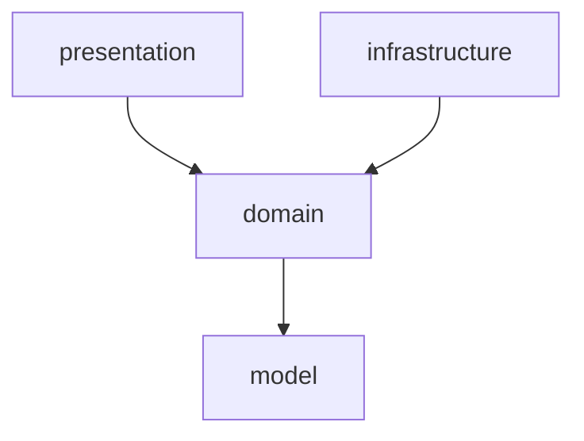

# CLAUDE.md

This file provides guidance to Claude Code (claude.ai/code) when working with code in this repository.

## Project Overview

**readwith** — a Spring Boot 4.0.5 web application using Java 25, Gradle 9.4.1, and Lombok.

## Build & Run Commands

```bash
# Build
./gradlew build

# Run the application
./gradlew bootRun

# Run all tests
./gradlew test

# Run a single test class
./gradlew test --tests "com.readwith.SomeTest"

# Run a single test method
./gradlew test --tests "com.readwith.SomeTest.methodName"

# Clean build
./gradlew clean build
```

## Architecture

- **Base package**: `com.readwith` — Spring Boot auto-scans from here
- **Framework**: Spring Boot 4.0.5 with `spring-boot-starter-webmvc` (servlet-based web)
- **Build**: Gradle with `io.spring.dependency-management` plugin for BOM-managed dependencies
- **Java version**: 25
- **Lombok**: Available in both main and test source sets (compileOnly + annotationProcessor)
- **Testing**: JUnit 5 via `junit-platform-launcher`; Spring test support via `spring-boot-starter-webmvc-test`

### Package Structure (4-Layer)

```
com.readwith
├── presentation/                # API 계층
│   └── controller/{feature}/
│       ├── {Feature}Controller.java
│       └── dto/
│           ├── {Action}Request.java
│           └── {Feature}Response.java
├── domain/                      # 비즈니스 로직
│   └── {feature}/
│       ├── service/
│       │   ├── {Action}Service.java         # Command 서비스
│       │   └── {Feature}SearchService.java  # Query 서비스
│       ├── out/
│       │   └── {Feature}{Action}Client.java # Port 인터페이스
│       └── dto/
│           ├── {Action}Command.java
│           ├── {Action}Result.java
│           └── {Feature}Result.java
├── infrastructure/              # 외부 의존 구현 (Adapter)
│   └── {feature}/{provider}/
│       └── {Port}Impl.java
└── model/                       # 엔티티, 리포지토리
    └── {feature}/
        ├── entity/
        │   └── {Entity}.java
        └── repository/
            └── {Entity}Repository.java
```

> Example 참조 구현체: 각 패키지의 `example/` 하위에 위치. 새 기능 생성 시 이 파일들을 참조할 것.

### Dependency Rules

모든 의존관계는 아래 방향만 허용한다. 역방향과 스킵 레이어 참조는 금지.



| From | To | Allowed | Notes |
|------|----|:-------:|-------|
| presentation | domain | O | Controller -> Service |
| infrastructure | domain | O | Port(out) 구현 |
| domain | model | O | Service -> Repository |
| presentation | model | **X** | Entity 직접 참조 금지 |
| presentation | infrastructure | **X** | |
| infrastructure | model | **X** | domain을 통해서만 접근 |
| domain | presentation | **X** | 역방향 금지 |
| domain | infrastructure | **X** | Port 인터페이스만 알고 있음 |

## Service Pattern

- 인터페이스 없이 구체 클래스 사용 (`@Service`, `@RequiredArgsConstructor`)
- `Impl` 접미사 사용 금지 (Service에 한함)
- **Command 서비스** (변경 작업): 단일 `execute(Command)` 메서드 -> Result 반환
- **Query 서비스** (조회 작업): 메서드명으로 의도를 드러내며, 여러 메서드 허용

## DTO Convention

- 파라미터 3개 이상이면 DTO(record) 사용
- **presentation DTO**: Request (`toCommand()` 포함), Response (`from(Result)` 포함)
- **domain DTO**: Command, Result
- 계층 간 변환 책임은 presentation DTO가 담당
- Entity <-> DTO 변환은 Service 내부 또는 domain DTO의 `from(Entity)` 정적 팩토리로 수행

## Port/Adapter Pattern

- **Port** 인터페이스: `domain/{feature}/out/` 에 위치
- **Adapter** 구현체: `infrastructure/{feature}/{provider}/` 에 위치, `Impl` 접미사 사용
- 외부 API, 메시징, 파일 시스템 등 외부 의존성을 추상화

## Entity Convention

- Lombok: `@Getter`, `@NoArgsConstructor(access = PROTECTED)`, `@AllArgsConstructor(access = PRIVATE)`
- 정적 팩토리 메서드: `create()` (신규 생성), `of()` (모든 필드 지정)
- setter 없이 불변 지향

## API Convention

- RESTful 원칙 준수
- 경로 패턴: `/api/v1/{resource}`
- `ResponseEntity`로 HTTP 상태 코드 명시

## Naming Conventions

| Category | Convention | Example |
|----------|-----------|---------|
| Command 서비스 | `{Action}Service` | `SignUpService` |
| Query 서비스 | `{Domain}SearchService` | `UserSearchService` |
| Command DTO | `{Action}Command` | `SignUpCommand` |
| Result DTO | `{Action}Result` / `{Domain}Result` | `SignUpResult`, `ExampleResult` |
| Request DTO | `{Action}Request` | `ExampleCreateRequest` |
| Response DTO | `{Domain}Response` | `ExampleResponse` |
| Port (out) | `{Domain}{Action}Client` | `ExampleSearchClient` |
| Adapter (infra) | `{Port}Impl` | `ExampleSearchClientImpl` |
| Controller | `{Domain}Controller` | `ExampleController` |
| Entity | 도메인명 그대로 | `User`, `ExampleEntity` |
| Repository | `{Entity}Repository` | `UserRepository` |

## API Response Format

- 성공 응답: `status 2XX`
  - data 블럭 내부에 단수는 `단수명사: {}`, 복수는 `복수명사: []`
  ```json
  {
    "data": {
      "user": { ... },
      "profiles": [ { ... }, ... ]
    }
  }
  ```
- 에러 응답: `status 4XX/5XX`
  ```json
  {
    "error": {
      "message": "이메일 형식이 올바르지 않습니다."
    }
  }
  ```

## Testing Conventions

- 서비스(Application) 레이어는 반드시 단위 테스트를 작성한다.
- 조회 기능은 DAO 통합 테스트를 반드시 수행한다.
- 테스트 메서드 네이밍: 행위를 설명하는 한글 이름을 허용한다.
  ```java
  @Test
  void 존재하지_않는_사용자를_조회하면_예외가_발생한다() { ... }
  ```

## Logging Levels

| 레벨 | 용도 | 예시 |
|------|------|------|
| ERROR | 즉시 대응이 필요한 장애 | 외부 API 실패, DB 연결 실패 |
| WARN | 잠재적 문제 | 재시도 성공, 폴백 동작 |
| INFO | 주요 비즈니스 흐름, I/O | 사용자 가입, 주문 생성 |
| DEBUG | 개발 디버깅 용도 | 운영 환경에서는 비활성화 |

## Git Conventions

- **Branch naming**: `main ← dev ← feature|bugfix|hotfix/{이슈번호}-{간단한-설명}`
- **Commit message**: Angular Convention
  ```
  <type>(<scope>): <subject>
  ```
  | type | 설명 |
  |------|------|
  | feat | 새로운 기능 추가 |
  | fix | 버그 수정 |
  | docs | 문서 변경 |
  | style | 코드 포맷팅 (기능 변경 없음) |
  | refactor | 리팩토링 (기능 변경 없음) |
  | test | 테스트 추가/수정 |
  | chore | 빌드, 설정 등 기타 변경 |
