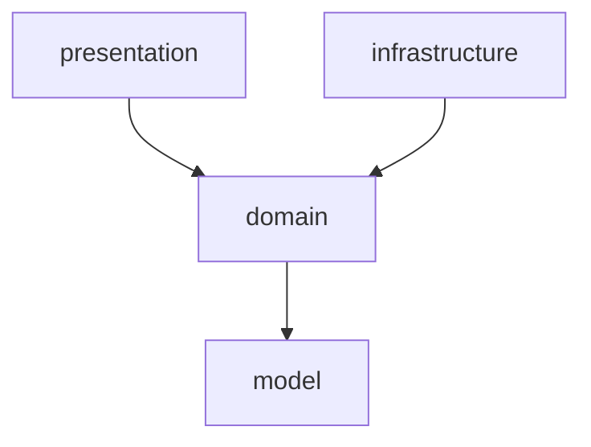

# 패키지 구조 (4계층)

> 적용 대상: 새 기능/파일을 어느 패키지에 둘지 정할 때, 계층 간 참조를 작성할 때.

## 4계층 구조

```text
com.readum
├── presentation/                # API 계층
│   └── controller/{feature}/
│       ├── {Feature}Controller.java
│       └── dto/
│           ├── {Action}Request.java
│           └── {Feature}Response.java
├── domain/                      # 비즈니스 로직
│   └── {feature}/
│       ├── service/
│       │   ├── {Action}Service.java         # Command 서비스
│       │   └── {Feature}SearchService.java  # Query 서비스
│       ├── out/
│       │   └── {Feature}{Action}Client.java # Port 인터페이스
│       └── dto/
│           ├── {Action}Command.java
│           ├── {Action}Result.java
│           └── {Feature}Result.java
├── infrastructure/              # 외부 의존 구현 (Adapter)
│   └── {feature}/{provider}/
│       └── {Port}Impl.java
└── model/                       # 엔티티, 리포지토리
    └── {feature}/
        ├── entity/
        │   └── {Entity}.java
        └── repository/
            └── {Entity}Repository.java
```

> Example 참조 구현체: 각 패키지의 `example/` 하위에 위치. 새 기능 생성 시 이 파일들을 참조할 것.

## 의존 방향



| From | To | 허용 | 비고 |
|------|----|:----:|------|
| presentation | domain | O | Controller -> Service |
| infrastructure | domain | O | Port(out) 구현 |
| domain | model | O | Service -> Repository |
| presentation | model | **X** | Entity 직접 참조 금지, domain 경유 필수 |
| presentation | infrastructure | **X** | |
| domain | presentation | **X** | 역방향 금지 |
| domain | infrastructure | **X** | Port 인터페이스만 알고 있음 |

## 표준 하위 외의 실제 패키지

실제 코드에는 위 표준 하위(`service` / `out` / `dto` / `config` / `exception`) 외에 다음 하위 패키지가 존재한다. 각각이 담는 것:

| 패키지 | 내용물 | 역할 |
|--------|--------|------|
| `domain/aiChat/event` | `FirstAssistantResponseCompletedEvent` (record) | 도메인 이벤트 정의 |
| `domain/aiChat/listener` | `AiChatTitleGenerationListener` | 트랜잭션 커밋 후(AFTER_COMMIT) 이벤트를 받아 후속 작업(제목 생성)을 비동기로 넘김 |
| `domain/aiChat/service/policy` | `SummaryDraftPolicy` | 도메인 상태 기반 가능/불가 판정 규칙을 서비스에서 분리한 정책 객체 |
| `domain/user/userbook` | `dto/` `exception/` `service/` | user 도메인 안의 중첩 기능 패키지 (내 책장) |

나머지 도메인(auth, book, summary)은 표준 하위 조합만 사용한다. 토큰 생성·파싱 같은 인프라 의존 동작은 별도 헬퍼 패키지가 아니라 규칙대로 Port(`domain/auth/out/TokenGenerator`) ← Adapter(`infrastructure/security/jwt/JwtTokenGeneratorImpl`) 로 구현돼 있다.

> CHECK: 위 4개 하위 패키지는 실태 기록일 뿐, "언제 event/listener/policy/중첩 기능 패키지를 만들어도 되는가" 의 배치 규칙은 아직 확정되지 않았다. 중간 엔티티 패키지 위치(user/userbook)·서비스 네이밍·유틸 분리 기준·도메인 문서 co-change 규칙 심사는 Epic #117 의 후속 이슈 대상이다.
