# AI 채팅 (aiChat) 시나리오

## 1. 세션 생성

사용자가 자기 책장의 책(userBook) 한 권에 대해 새 채팅 세션을 만든다 (`AiChatSessionCreateService`).

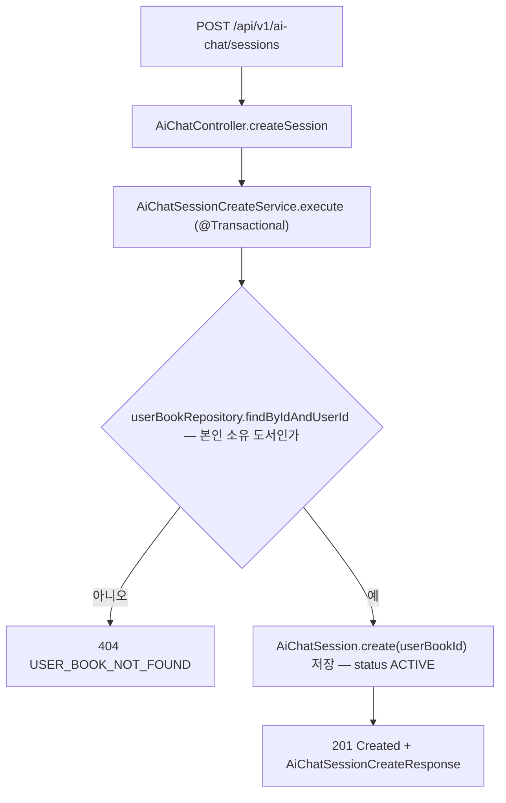

## 2. 세션 목록 조회 — 표시 상태 합성

한 책(userBook)의 세션들을 페이지 조회하며, DB 의 두 상태(세션 ACTIVE/LOCKED + summary_job 존재 여부)를 JPQL CASE 로 화면용 ACTIVE/SUMMARIZING/SUMMARIZED 로 합성한다 (`AiChatSessionSearchService`).

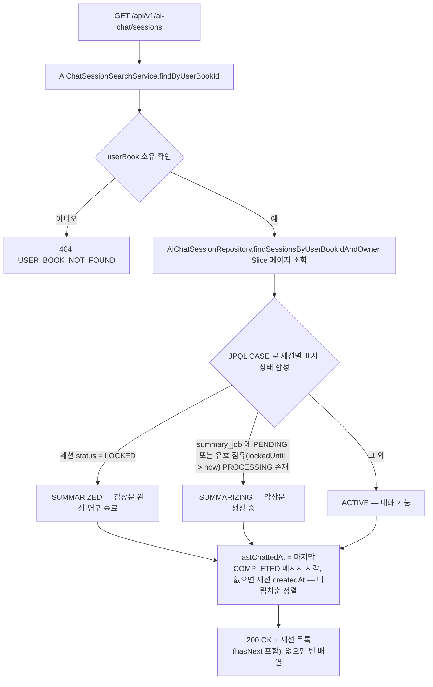

## 3. 책별 세션 목록 조회

한 책의 모든 세션을 책 정보·세션별 최신 감상문 본문·마지막 대화일과 함께 조회한다 — repository 는 각자 자기 엔티티만 반환하고 합성은 service 책임 (`BookChatSessionSearchService`).

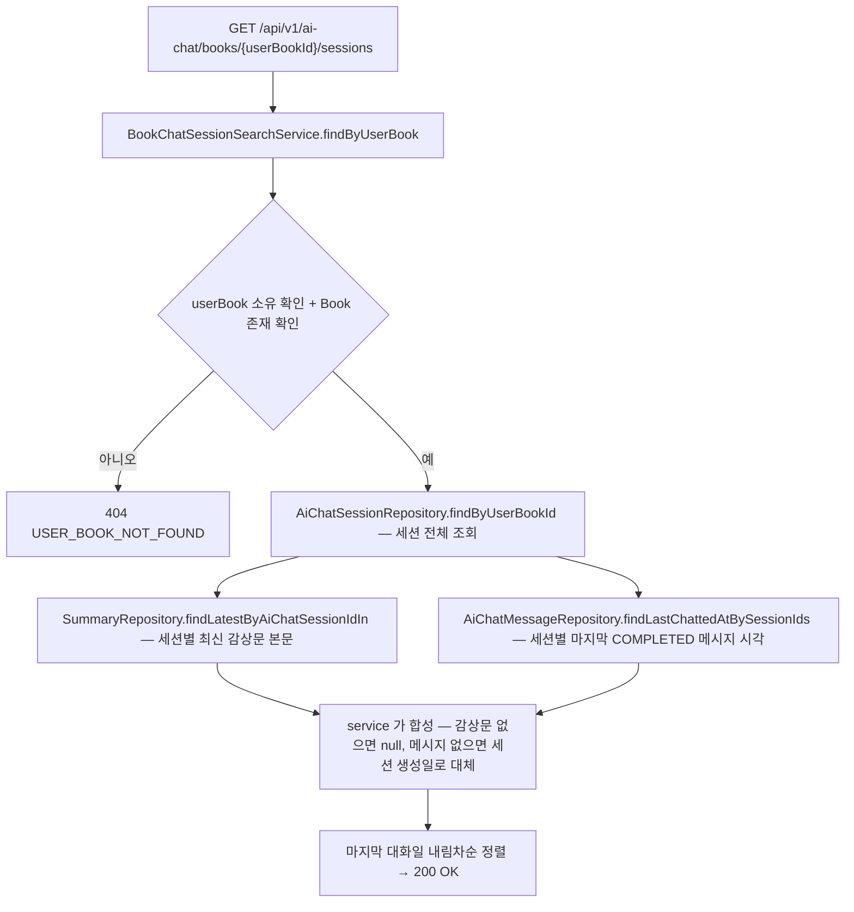

## 4. 메시지 전송 (SSE 스트리밍)

사용자 메시지를 검증·moderation 후 저장하고 AI 응답을 SSE 로 흘려보낸다 — 정상/에러/중단 종료를 모두 영속화 정책으로 흡수한다 (`AiChatMessageSendService`).

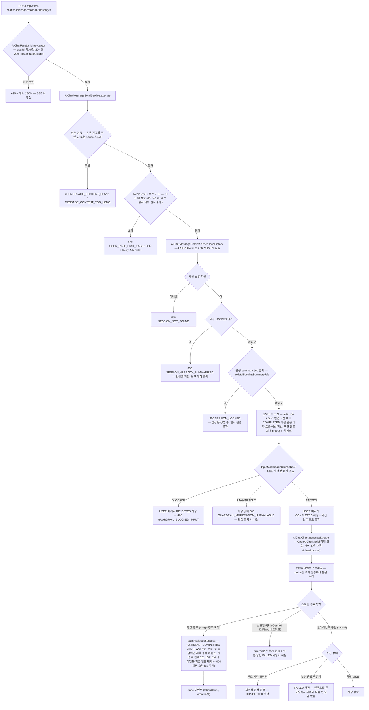

## 5. 메시지 이력 조회

세션의 메시지를 최신순으로 페이지 조회한다 — COMPLETED 만 노출하고 FAILED(부분 응답)·REJECTED(차단 입력)는 제외한다 (`AiChatMessageSearchService`).

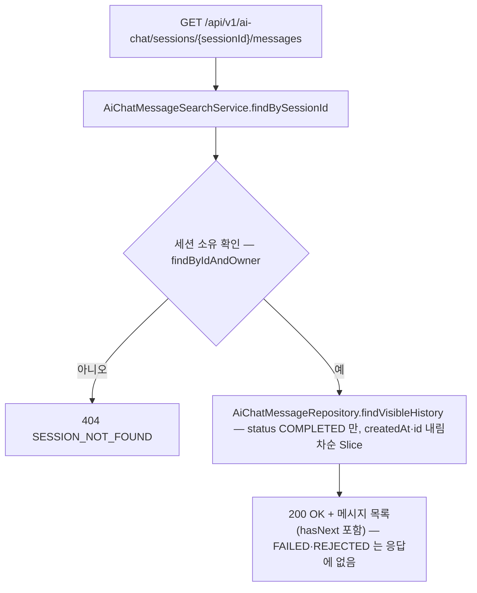

## 6. 감상문 조회

세션의 감상문을 조회한다 — 생성 중이면 409 로 폴링을 유도하고, 실패로 행이 없으면 404 (`SummarySearchService`, summary 도메인).

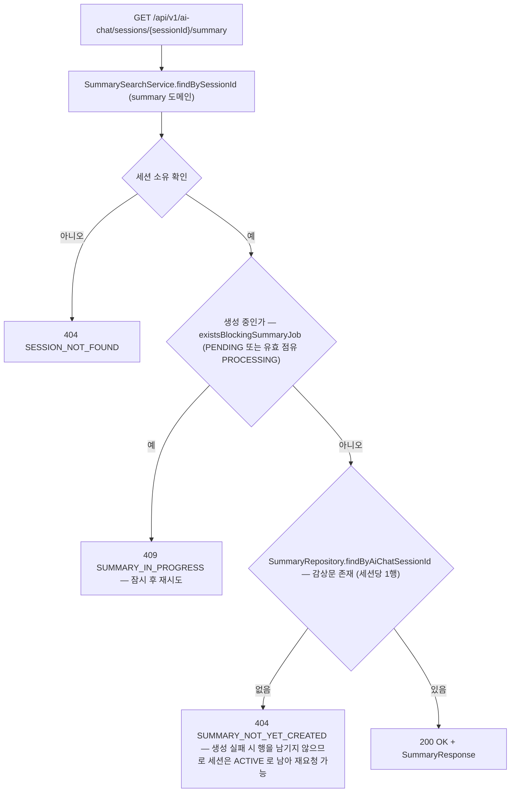

## 7. 감상문 수정

완성된 감상문의 제목·본문을 사용자가 직접 수정한다 — LLM 무관 (`SummaryEditService`).

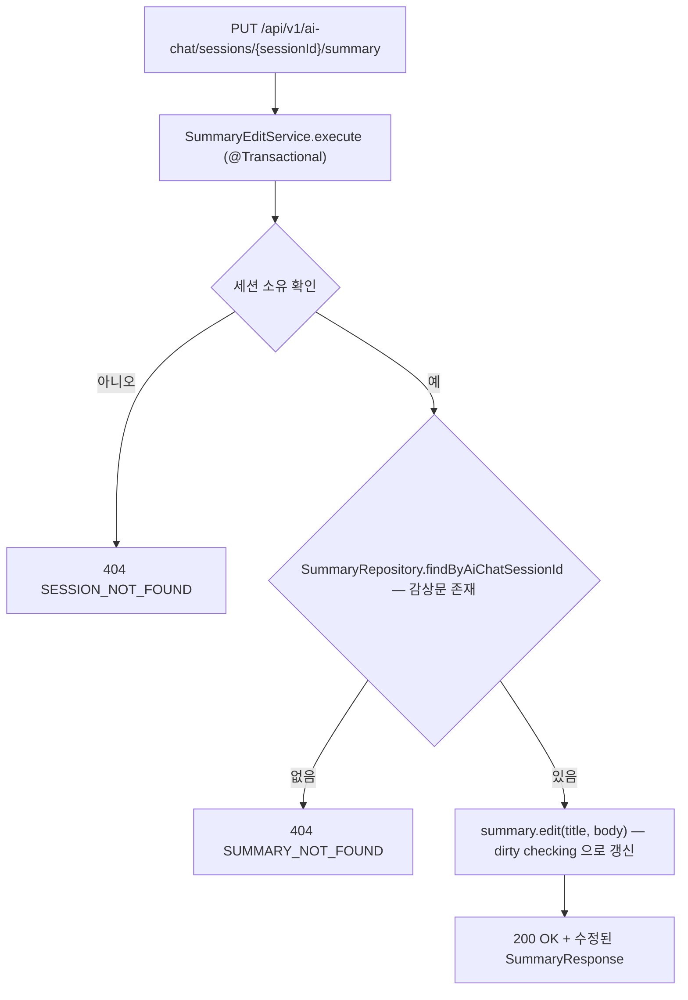

## 8. 감상문 초안 자격·진행률 조회

부수 효과 없이 초안 생성 가능 여부·사유·진행률(누적 토큰 500 기준 %)을 반환한다 (`SummaryDraftSearchService` + `SummaryDraftPolicy`).

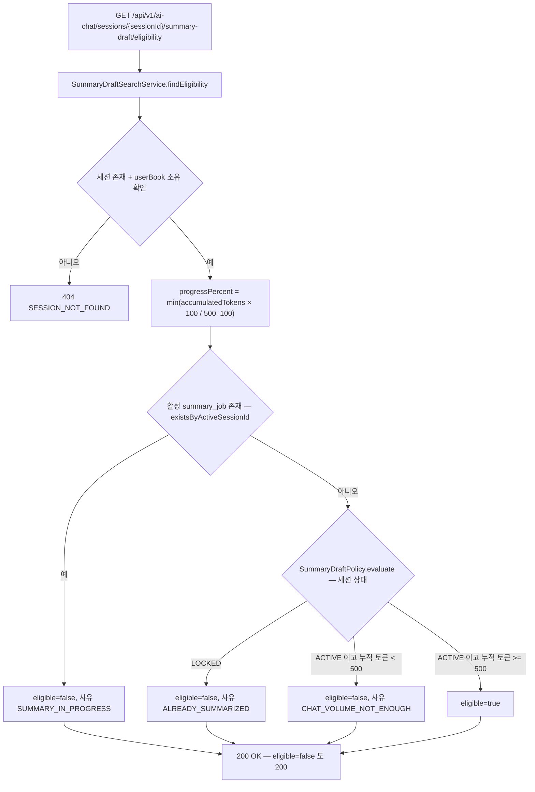

## 9. 감상문 초안 생성 요청 — 작업 적재만

생성 요청을 받아 SummaryJob 을 큐에 적재만 하고 202 를 반환한다 — 실제 생성은 백그라운드 워커 몫 (`SummaryDraftService` → `EnqueueSummaryJobService`).

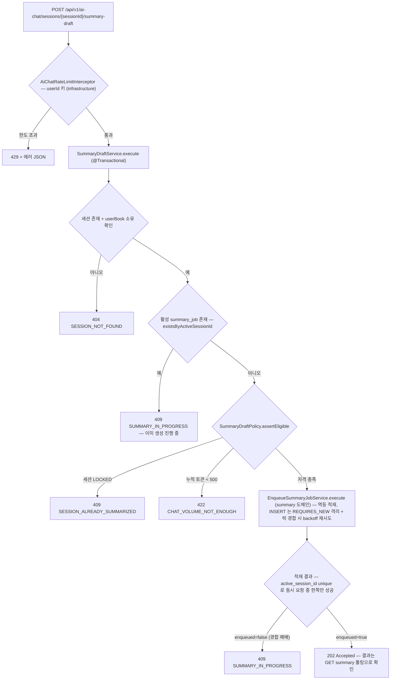

## 10. 세션 제목 자동 생성 (비동기)

첫 ASSISTANT 응답 저장이 커밋된 뒤 이벤트로 트리거되어, 전용 격벽 스케줄러에서 LLM 으로 제목을 만들고 짧은 트랜잭션으로 갱신한다 (`AiChatTitleGenerationListener` → `AiChatSessionTitleService`).

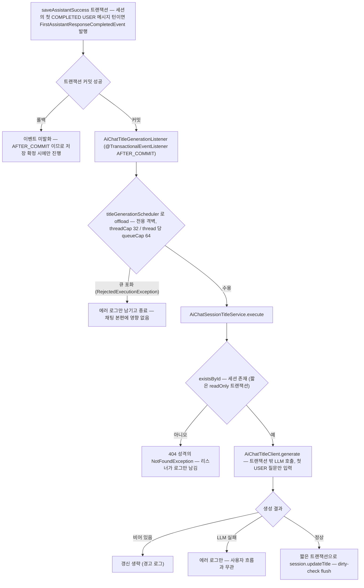

## 11. 감상문 자동 생성 적재 (매일 06:00)

스케줄러가 자격 있는 세션의 생성 작업을 집합 단위 단일 INSERT 로 적재한다 — 직접 생성하지 않는다 (`SummaryScheduler`, infrastructure).

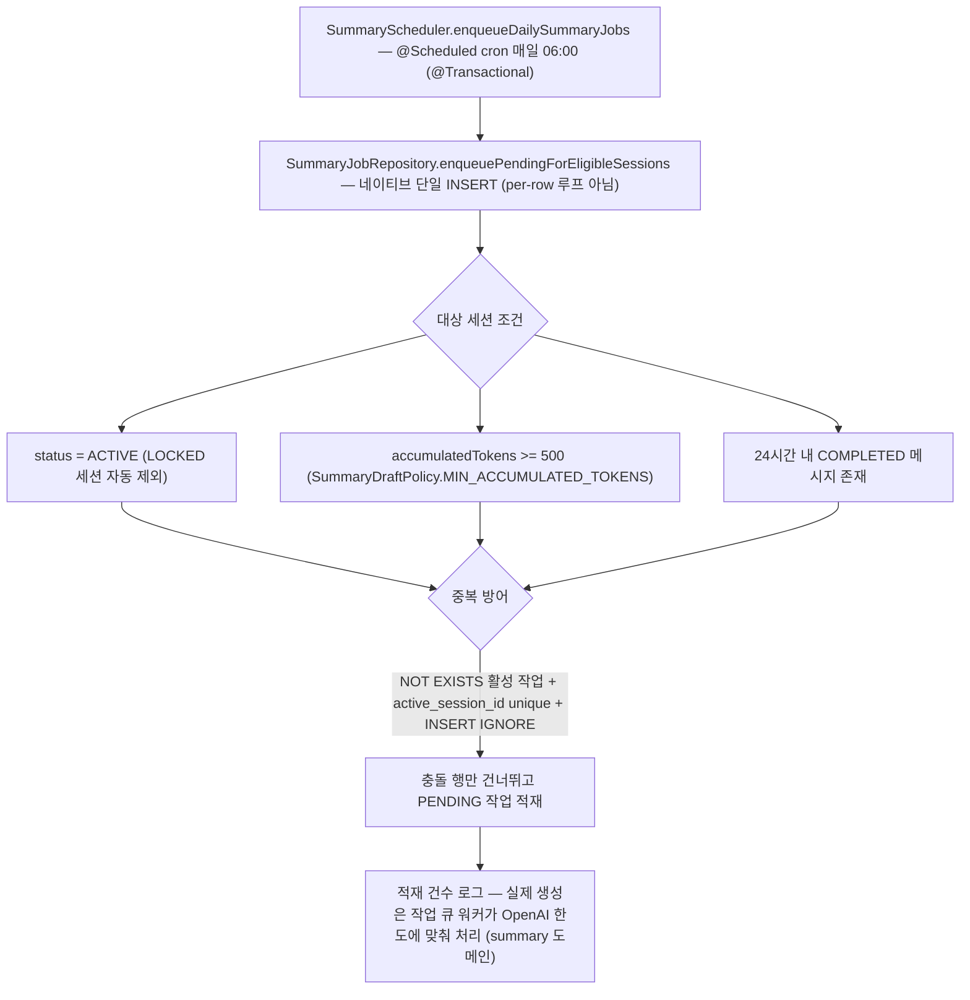

## 12. 세션 영구 잠금 — 감상문 확정과 같은 트랜잭션

워커가 생성에 성공하면 감상문 저장 + `session.lock()` + 작업 성공 처리를 한 트랜잭션으로 묶는다 — LOCKED 는 영구 상태로 되돌리는 메서드가 없다 (`SummaryJobLifecycleService.recordSuccess`, summary 도메인).

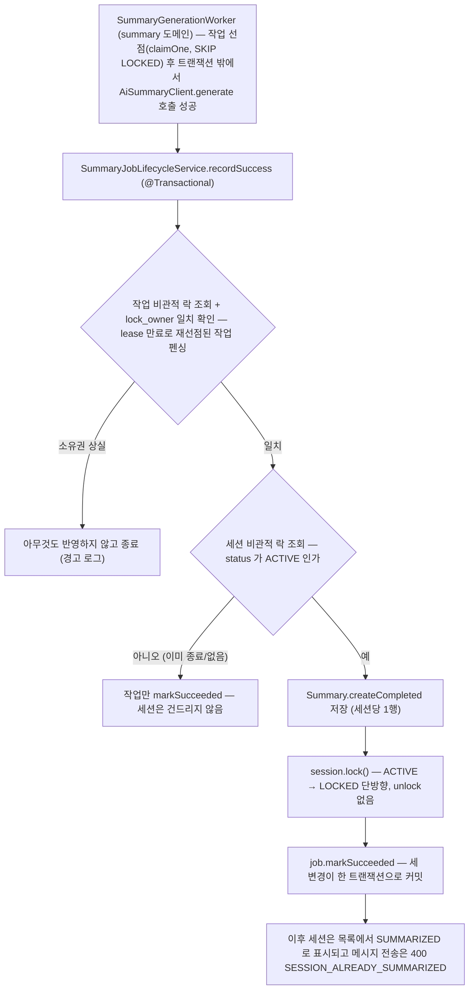
