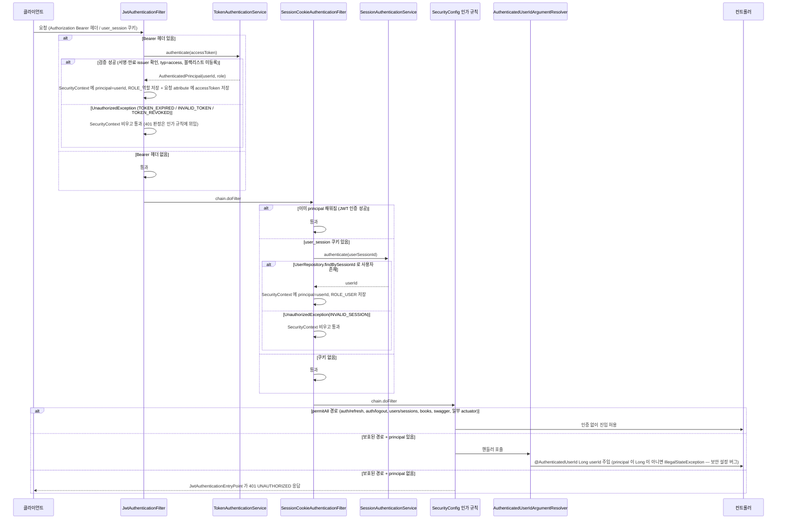
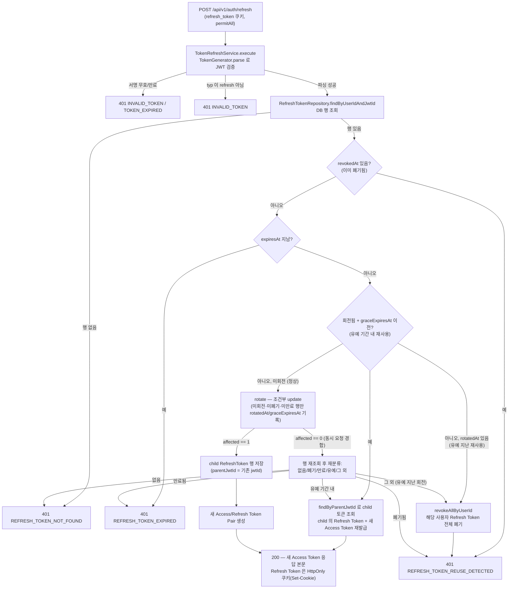
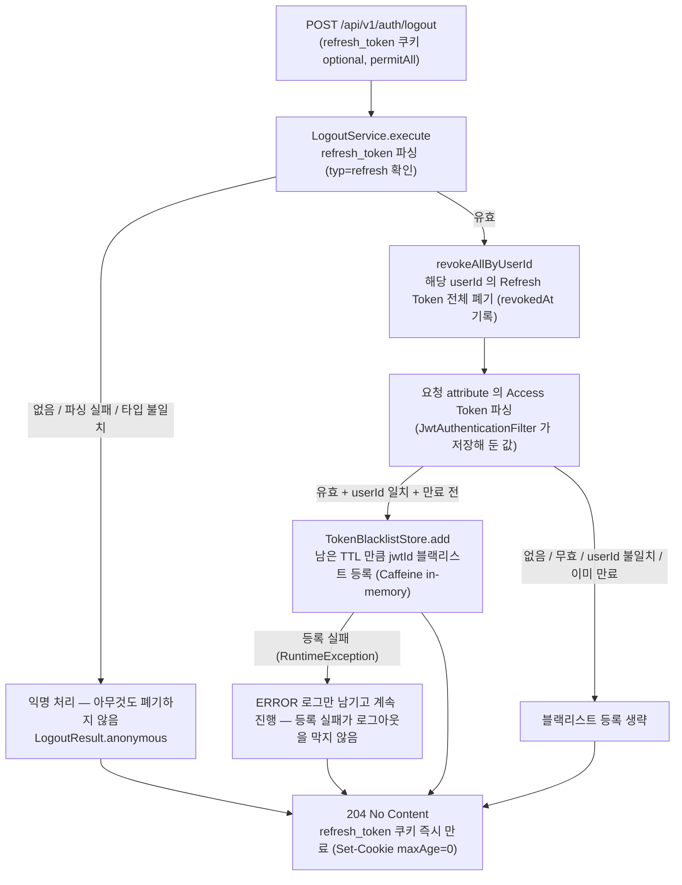
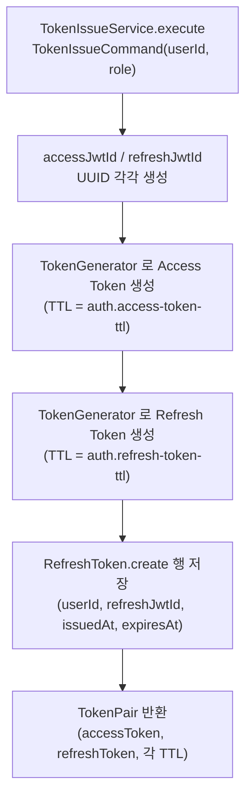

# 인증 (auth) 시나리오

## 1. 요청 인증 (필터 체인)

모든 보호된 API 요청은 두 인증 필터(JWT → 세션 쿠키)가 신원을 principal(userId) 로 해석하고, 인가 규칙이 401 판정을 담당하며, 컨트롤러는 `@AuthenticatedUserId` 로만 userId 를 받는다.

## 2. Access Token 재발급 (Refresh Token rotation)

`POST /api/v1/auth/refresh` — 쿠키의 Refresh Token 을 검증해 새 Token Pair 를 발급하고, 기존 토큰은 회전(rotation) 처리한다. 회전 직후 유예 기간(grace period) 내 재사용은 기존 child 토큰을 다시 내려주고, 유예를 지난 재사용은 재사용 감지로 그 사용자의 Refresh Token 전체를 폐기한다.

## 3. 로그아웃

`POST /api/v1/auth/logout` — Refresh Token 을 전부 폐기하고 Access Token 을 블랙리스트에 등록하며, 토큰이 없거나 무효여도 항상 204 로 응답한다 (멱등).

## 4. Token Pair 발급 (TokenIssueService)

로그인 성공 시 새 Access/Refresh Token Pair 를 만들고 Refresh Token 을 DB 에 저장하는 서비스 — 아직 호출하는 컨트롤러가 없다 (소셜 로그인 도입 대비, 현재는 테스트에서만 사용).

