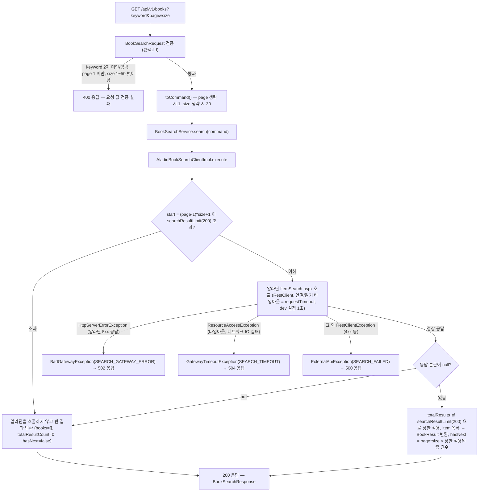
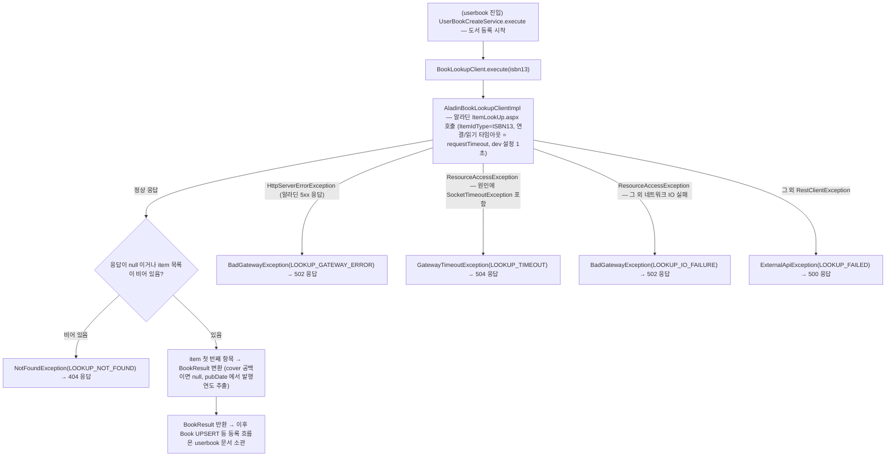

# 도서 검색 (book) 시나리오

## 1. 키워드 도서 검색

사용자가 검색어로 외부(알라딘 ItemSearch API) 도서를 검색해 페이지네이션 결과를 받는다.

## 2. 도서 상세 확보 (BookLookupClient)

내 책장에 도서를 등록할 때(userbook 진입) `UserBookCreateService` 가 ISBN13 으로 알라딘 ItemLookUp API 에서 도서 원천 정보를 확보한다. 확보 이후의 등록 흐름은 userbook 문서 소관.

