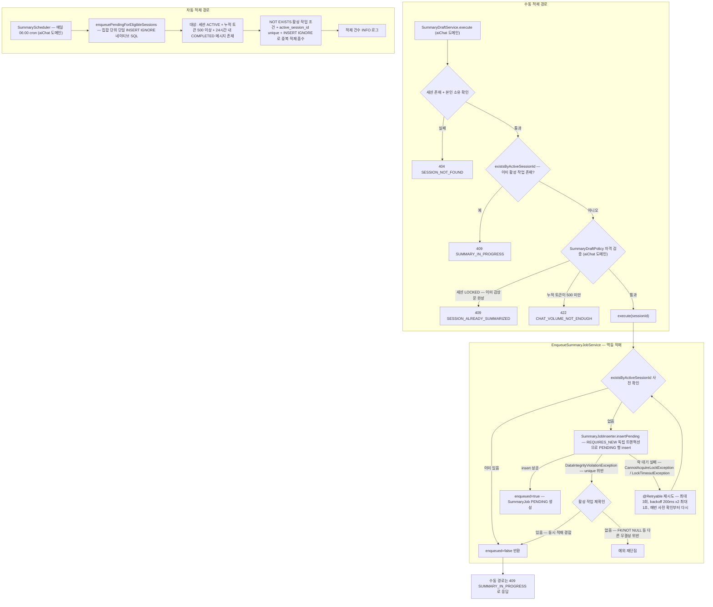
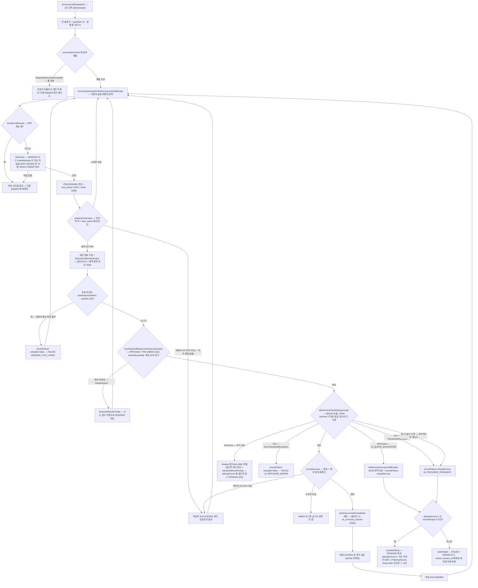
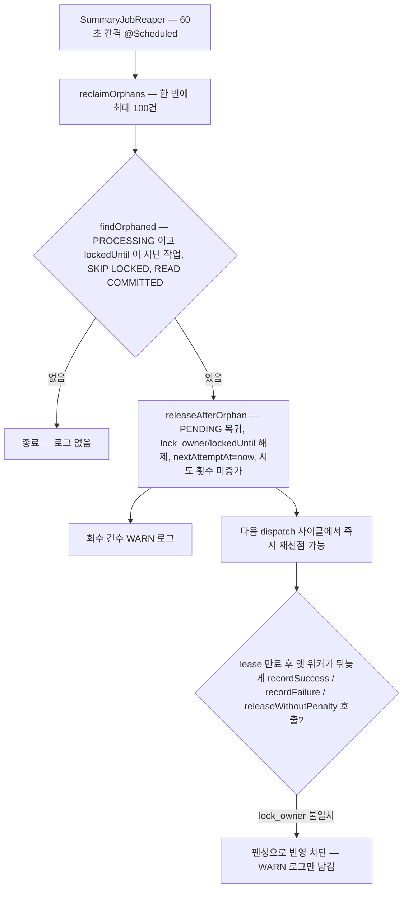
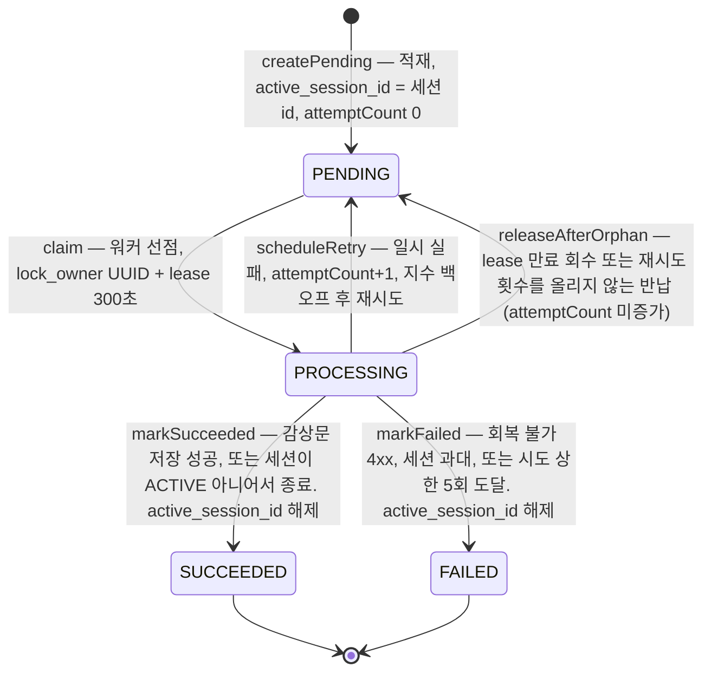

# 감상 기록 (summary) 시나리오

## 1. 감상문 생성 작업 적재

수동 요청(aiChat 도메인 `SummaryDraftService` 경유)과 매일 06:00 자동 스케줄러 두 경로로 `summary_job` 을 적재하며, `active_session_id` unique 제약으로 "세션당 활성 작업 1개" 멱등을 보장한다.

## 2. 감상문 생성 파이프라인

디스패처가 2초 간격으로 워커를 풀(12)에 제출하고, 워커는 SKIP LOCKED 로 작업을 선점한 뒤 트랜잭션 밖에서 OpenAI 를 호출해 성공 시 Summary 저장 + 세션 잠금, 실패 시 분류에 따라 재시도, 재시도 횟수를 올리지 않는 반납, FAILED 처리한다.

## 3. 고아 작업 회수

서버 재시작·워커 장애로 lease(300초)가 만료된 PROCESSING 작업을 SummaryJobReaper 가 60초마다 PENDING 으로 되돌리고, 늦게 돌아온 옛 워커의 반영 시도는 lock_owner 펜싱으로 차단한다.

## 4. 감상 기록 조회 3종 (목록 / 월별 캘린더 / 상세)

SummaryController 의 조회 API 세 개 — 본인 감상 기록 목록(Slice 20개), 홈 캘린더용 월별 독서 기록, 감상문 단건 상세.

```mermaid
flowchart TD
    subgraph list["감상 기록 목록 — GET /api/v1/summaries"]
        L1["SummaryHistorySearchService.findMyHistory"] --> L2["findLatestHistoryByUserId — Summary + AiChatSession + UserBook + Book join projection, userId 필터가 소유권 검증 겸함"]
        L2 --> L3["세션당 최신 감상문 1건, createdAt 내림차순, 페이지 크기 20 고정 Slice"]
        L3 --> L4["200 — 항목 리스트 + hasNext, 기록 없으면 빈 배열"]
    end

    subgraph calendar["월별 독서 기록 — GET /api/v1/summaries/calendar"]
        C1["SummarySearchService.findMonthly — @Transactional(readOnly=true) 로 여러 Repository 를 한 스냅샷으로 묶음"] --> C2{"내 UserBook 존재?"}
        C2 -->|"없음"| C3["200 — 빈 배열"]
        C2 -->|"있음"| C4["UserBook 들의 세션 조회 + 세션별 마지막 COMPLETED 메시지 시각 조회"]
        C4 --> C5{"마지막 채팅 시각이 해당 월 안?"}
        C5 -->|"채팅이 한 번도 없는 세션"| C6["결과에서 제외"]
        C5 -->|"해당 월"| C7["세션별 최신 감상문 id 조회 — 없으면 summaryId=null 로 포함"]
        C7 --> C8["책 제목 합성 후 lastChattedAt 내림차순, 같으면 chatSessionId 내림차순 정렬"]
        C8 --> C9["200 — 평탄한 리스트, 날짜별 그룹핑은 클라이언트 담당"]
    end

    subgraph detail["감상 기록 상세 — GET /api/v1/summaries/{summaryId}"]
        D1["SummarySearchService.findById"] --> D2{"Summary 존재?"}
        D2 -->|"없음"| D3["404 SUMMARY_NOT_FOUND"]
        D2 -->|"있음"| D4{"UserBook 이 본인 소유?"}
        D4 -->|"아니오 — 소유권도 404 로 감춤"| D3
        D4 -->|"예"| D5["200 — 제목·본문 반환"]
    end
```

## 5. SummaryJob 상태 전이

`SummaryJob.Status` enum(PENDING / PROCESSING / SUCCEEDED / FAILED)의 전이 — 미완료(PENDING/PROCESSING) 동안만 active_session_id 가 세션 id 를 유지해 unique 제약으로 멱등을 보장한다.

