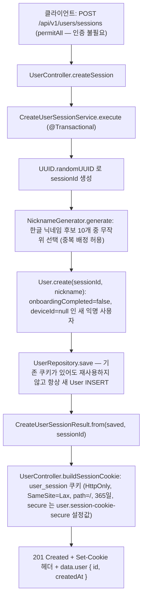
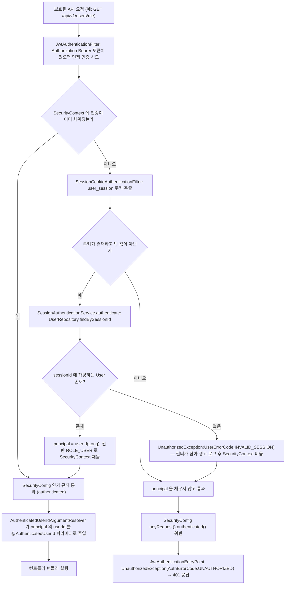
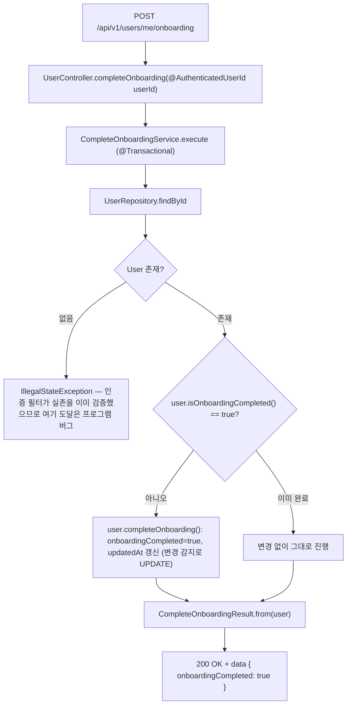
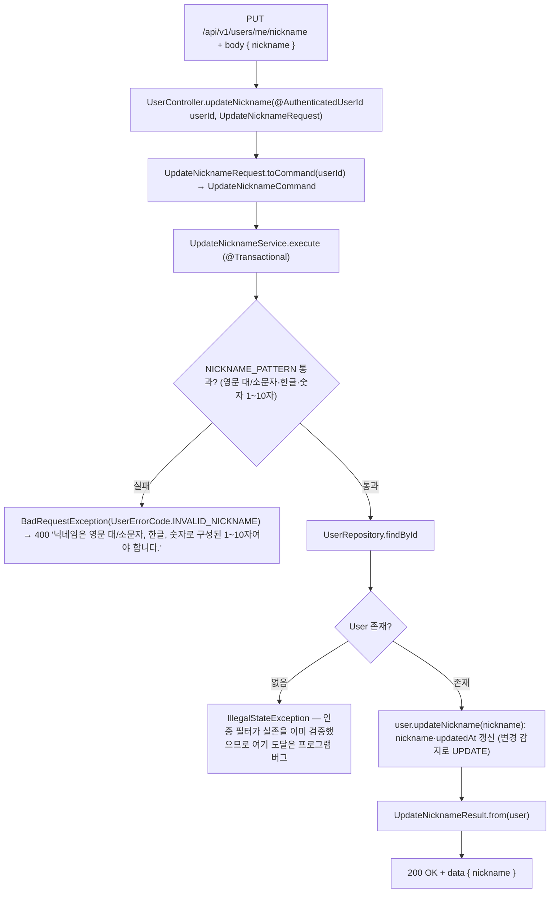

# 회원 (user) 시나리오

## 1. 사용자 세션 생성 (익명 가입 겸 로그인)

`POST /api/v1/users/sessions` — 인증 없이 호출 가능한 유일한 사용자 엔드포인트. 로그인이 따로 없고, 호출할 때마다 새 익명 사용자(User 행)를 만들고 `user_session` 쿠키를 발급한다. 쿠키 발급은 서비스가 아니라 `UserController` 가 담당한다.

## 2. 세션 쿠키 인증 (보호된 API 공통 전처리)

`/me` 계열을 포함한 모든 보호된 API 는 요청 처리 전에 `JwtAuthenticationFilter` 가 `Authorization: Bearer` 토큰을 먼저 인증 시도하고, 인증이 비어 있으면 `SessionCookieAuthenticationFilter` 가 `user_session` 쿠키를 userId 로 해석해 principal 을 채운다. 컨트롤러는 `@AuthenticatedUserId Long userId` 로만 신원을 받는다.

## 3. 현재 세션 정보 조회 · 내 프로필 조회

`GET /api/v1/users/me` 와 `GET /api/v1/users/me/profile` — 인증된 userId 로 사용자를 조회하는 단순 조회 두 건. `/me` 는 userbook 존재 여부(`hasRegisteredBooks`)를 합성해 돌려준다.

```mermaid
flowchart TD
    A["GET /api/v1/users/me"] --> B["UserController.getSessionInfo(@AuthenticatedUserId userId)"]
    B --> C["UserSearchService.findSessionInfo"]
    A2["GET /api/v1/users/me/profile"] --> B2["UserController.getProfile(@AuthenticatedUserId userId)"]
    B2 --> C2["UserSearchService.findProfile"]
    C --> D["UserRepository.findById"]
    C2 --> D
    D --> E{"User 존재?"}
    E -- 없음 --> F["IllegalStateException — 인증 필터가 실존을 이미 검증했으므로 여기 도달은 프로그램 버그"]
    E -- 존재 --> G{"어느 조회인가"}
    G -- findSessionInfo --> H["UserBookRepository.existsByUserId 로 hasRegisteredBooks 계산 (userbook)"]
    H --> I["UserSessionInfoResult.from(user, hasRegisteredBooks)"]
    I --> J["200 OK + data.session { lastSelectedUserBookId, hasRegisteredBooks, onboardingCompleted } — lastSelectedUserBookId 는 null 이어도 키 노출"]
    G -- findProfile --> K["UserProfileResult.from(user)"]
    K --> L["200 OK + data.profile { nickname } — 닉네임 없는 기존 사용자도 키는 항상 노출 (값 null)"]
```

## 4. 온보딩 완료 처리

`POST /api/v1/users/me/onboarding` — 현재 사용자의 `onboardingCompleted` 플래그를 true 로 갱신한다. 이미 완료된 상태면 아무 것도 바꾸지 않고 같은 결과를 돌려준다 (여러 번 호출해도 결과 동일).

## 5. 닉네임 수정

`PUT /api/v1/users/me/nickname` — 요청 본문의 닉네임을 검증(영문 대/소문자·한글·숫자 1~10자, `NICKNAME_PATTERN`)한 뒤 현재 사용자의 닉네임을 변경한다.

