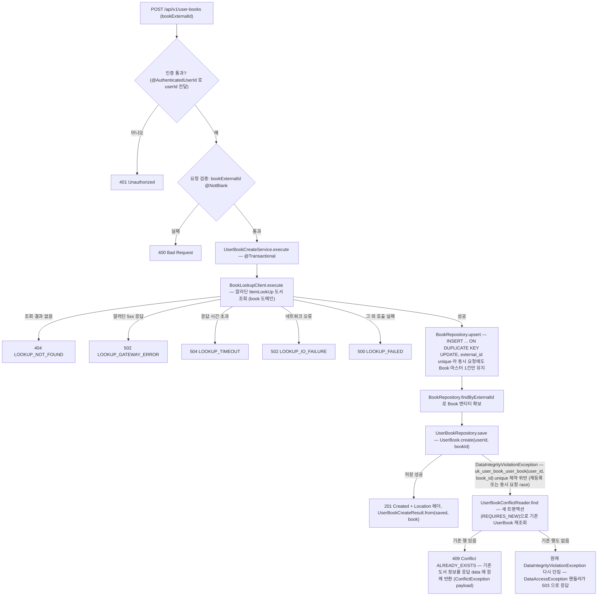
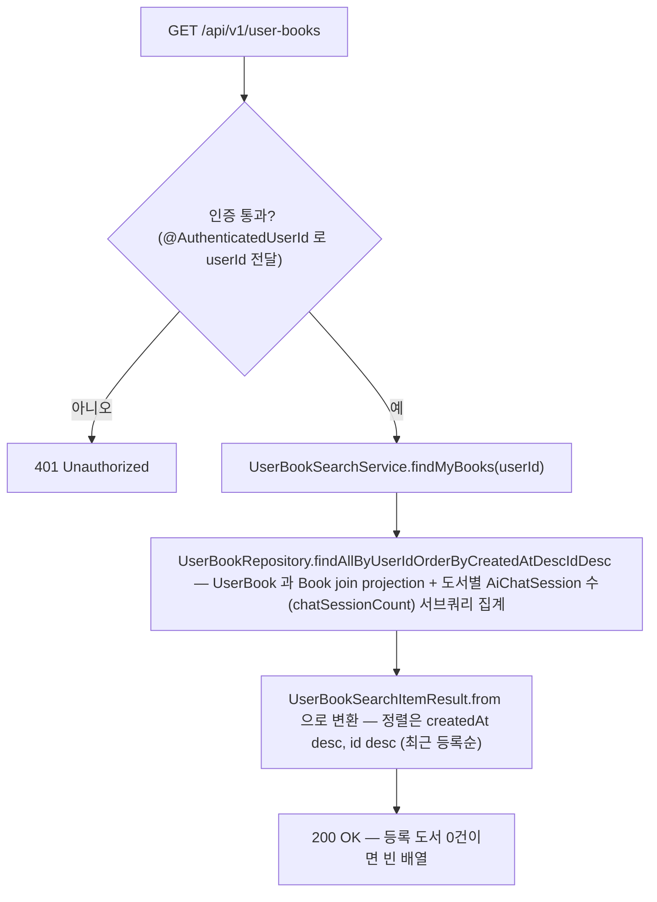
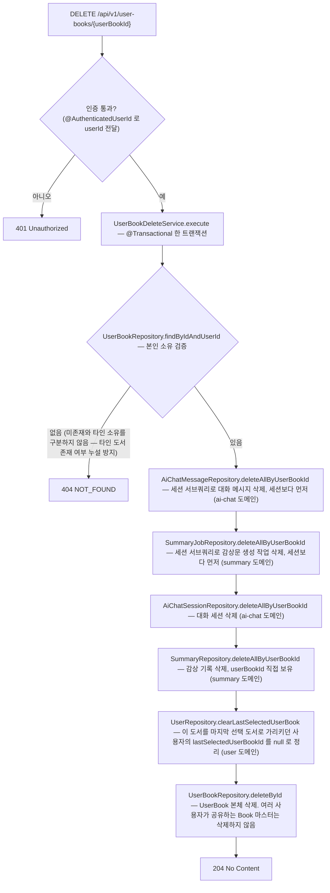

# 내 책장 (userbook) 시나리오

## 1. 내 책장 도서 추가

로그인한 사용자가 외부 도서 식별자(ISBN13)로 도서를 책장에 추가한다. Book 마스터가 없으면 알라딘 조회 결과로 생성(upsert)하고, 이미 책장에 있는 도서면 409 를 반환한다.

## 2. 내 책장 목록 조회

로그인한 사용자가 책장에 등록한 도서 목록을 최근 등록순으로 조회한다. 도서마다 연결된 AI 대화 세션 수를 함께 내려준다.

## 3. 내 책장 도서 삭제

로그인한 사용자가 자기 책장의 도서를 삭제하면, 그 도서를 가리키는 연관 데이터(AI 대화 메시지·감상문 생성 작업·세션·감상 기록·마지막 선택 도서 참조)를 한 트랜잭션에서 순서대로 함께 삭제한다. DB FK/JPA cascade 없이 서비스 계층이 명시 삭제한다.

